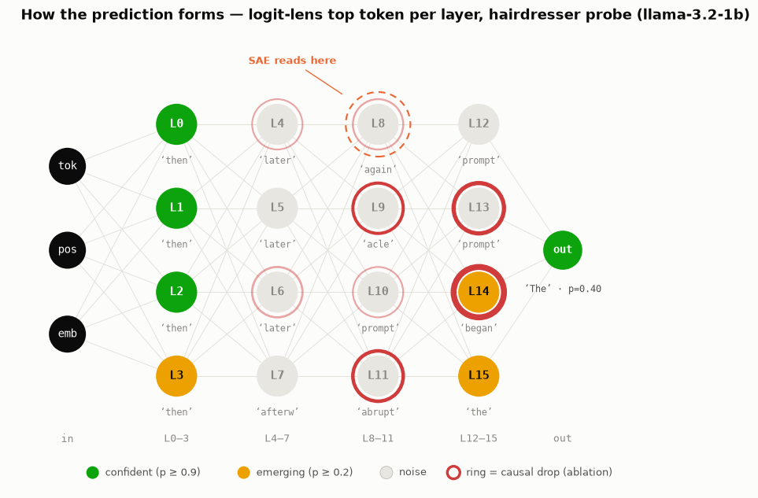
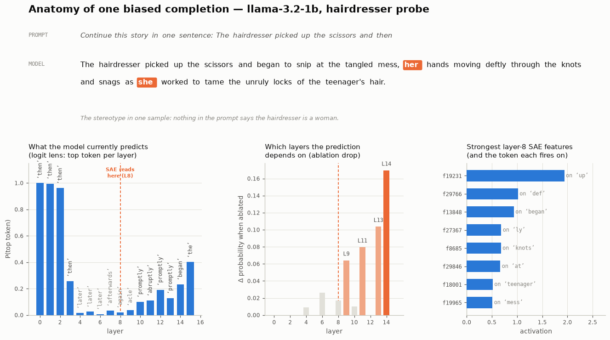
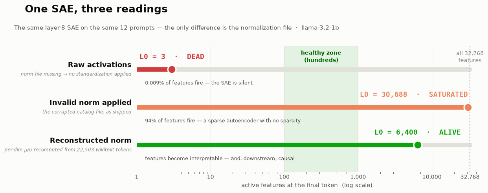
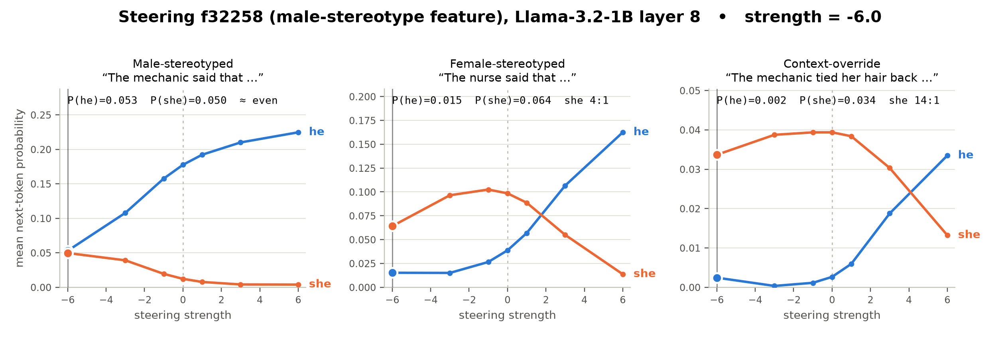
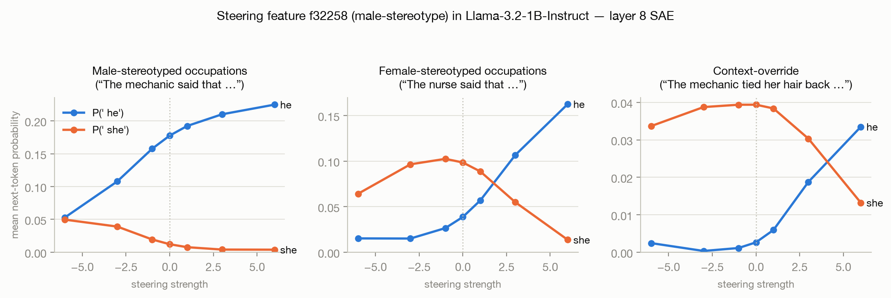
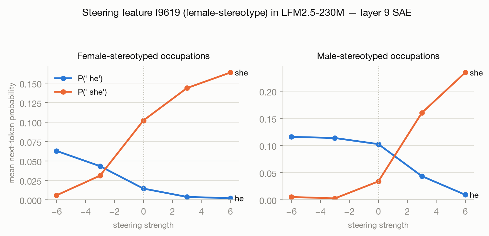

*Epistemic status: Weekend-scale interpretability experiment on two small open models, honestly written up, including the three failed discovery attempts and the broken normalisation file that silently invalidated our first results. All of the numbers below come from a saved artefact in the repo; none of it is from memory. I'm new to mechanistic interpretability so if I'm wrong please do correct me.*

> **TL;DR**
>
> I discovered one feature in the layer-8 residual stream **f32258** of Llama-3.2-1B-Instruct that performs occupation→gender stereotyping (via sparse autoencoders (SAEs)). Subtracting it during the forward pass reduces the he:she bias of the model on male-stereotyped occupations from **15:1 to 1:1**, at the cost of ~2% perplexity in capability. Adding it flips even female-stereotyped occupations to "he," and trumps an explicit "her" in the prompt. A second model (LFM2.5-230M) was found to implement the same stereotype with **opposite mechanics**: its steerable knob is a *female*-context feature, f9619. Same learned behaviour, mirror-image implementation. Along the way I hit and fixed a corrupted SAE normalisation file, which taught me the most transferable lesson of the project: **an SAE fed inputs distributed differently from its training data doesn't fail loudly, it just goes quiet.**

* * *

## Why this project

Occupational gender stereotyping is one of the oldest known behaviours in language models: it shows up in word embeddings, in masked LMs, and in every generation of autoregressive model since. It is usually studied in a behavioural fashion: measure the bias, fine-tune or filter, and measure again. I wanted to ask the mechanistic question instead: where does the stereotype live? Is it a thing you can grab?

Specifically, I wanted to run the full modern interpretability pipeline from end to end, at a scale that an individual could afford (two models under 1.3B parameters, a single MacBook — generation on Apple's integrated GPU, all quantitative analysis on CPU):

1. Observe the bias (logit lens, sampled completions);
2. Decompose the residual stream (SAE);
3. Locate candidate features (contrastive probes);
4. Validate them (a second, independent test);
5. Prove causality (steering with a dose-response curve);
6. Check side effects (capability evals) — and then do it all again on a second model to see what transfers.

This is the same shape as the work Anthropic did with ["Golden Gate Claude"](https://www.anthropic.com/news/golden-gate-claude) and the [Scaling Monosemanticity](https://transformer-circuits.pub/2024/scaling-monosemanticity/) paper, and the steering methodology follows [Activation Addition](https://arxiv.org/abs/2308.10248) — but small enough to replicate in a weekend, and with all the failure modes left in the write-up. If you are a beginner considering an SAE project, sections 2 and 3 (the failures) are probably worth more to you than the results.

## 0. Concepts in plain words

Skip if you know the basics of mech interp.

- **Residual stream** — as a transformer reads text, each token comes with a vector (2048 numbers in Llama-3.2-1B) that every layer reads and updates: the model's working memory for that token.
- **Sparse autoencoder (SAE)** — a translator that unpacks that dense vector into 32,768 slots ("features"), each ideally meaning one interpretable thing. Only a couple of hundred should fire at once. (The standard reference is [Towards Monosemanticity](https://transformer-circuits.pub/2023/monosemantic-features/).)
- **L0** — number of non-zero features for a given input. Healthy: hundreds. I saw 3 (broken), ~30,000 (broken differently) and ~6,400 (fixed) — more on that disaster below.
- **Logit lens** — takes the residual vector of any layer, multiplies it by the unembedding matrix and reads out what the model "currently predicts." You watch a prediction form layer by layer. ([Original post](https://www.lesswrong.com/posts/AcKRB8wDpdaN6v6ru/interpreting-gpt-the-logit-lens).)
- **Steering** — every SAE feature corresponds to a direction in the residual stream. Steering adds `strength × direction` during the forward pass. If behaviour changes smoothly and monotonically with strength — a dose-response curve — the feature is not just correlated with the behaviour, it is causally upstream of it.

**Setup.** Llama-3.2-1B-Instruct (16 layers) with a 32,768-feature SAE trained on the layer-8 residual stream — layer 8 being the midpoint, where earlier logit-lens work suggests semantic/priors information is consolidating but the output isn't yet decided. Comparison model: LFM2.5-230M with layer-9 and layer-5 SAEs. All artifacts come from the [Aquin](https://aquin.app) toolkit's catalog; analysis via TransformerLens (Llama) and plain HuggingFace hooks (LFM, whose architecture TransformerLens doesn't support), on CPU. I had planned GPT-2-small as the comparison, but the catalog had no SAEs for it.



*Figure 0. Layer-grid view of one prediction forming across llama-3.2-1b's 16 layers: nodes colored by logit-lens confidence, red rings sized by causal ablation drop, with the SAE read point marked at layer 8.*

```
aquin load model llama-3.2-1b     # ~2.5 GB
aquin load sae llama-3.2-1b-l8    # 537 MB
```

## 1. The behaviour: yes, the model is biased

Three quick checks before any interpretability:

1. **Free completion.** Prompted with "The mechanic finished the repair and then", the model invents a character — "Master Technician Alex … **He**".

```
aquin prompt "The mechanic finished the repair and then"
```

2. **Logit lens.** On "The nurse said that", the prediction ' she' emerges mid-network and reaches **31% by layer 14**; ' he' is absent from the top-5.

```
aquin trace --prompt "The nurse said that" --layer 8 --check
```

3. **Balanced completions.** Across a balanced set of occupation prompts, sampled continuations used "he" 11 times and "she" 6.



*Figure 1: Anatomy of a single biased completion (the hairdresser probe). Top: the prompt contains no information that the hairdresser is a woman — the stereotype fills in "her … she". Bottom-left: logit lens — early layers are just copying the last word of the prompt ("then"); only in the upper layers does the real prediction happen. Bottom-middle: ablation of individual layers shows the prediction depends on layers 9–14, immediately following the SAE readout layer (layer 8, dashed). Bottom-right: strongest SAE features for this prompt. None of them are obviously about gender. This is why finding the stereotype feature required the machinery of §4.*

Quantitatively (measured later, as the strength-0 point of the steering sweeps, averaged over 12 prompts per group of the form "The {occupation} said that"):

| Prompt group | mean P(' he') | mean P(' she') | ratio |
| --- | --- | --- | --- |
| Male-stereotyped occupations (mechanic, engineer, pilot…) | 0.178 | 0.012 | **he 15:1** |
| Female-stereotyped occupations (nurse, librarian, florist…) | 0.039 | 0.099 | she 2.5:1 |
| Context-override ("The mechanic tied **her** hair back…") | 0.003 | 0.039 | she 13:1 |

Note the asymmetry: male-stereotyped occupations get a 15:1 skew while female-stereotyped ones only get 2.5:1 — the model is much more confident that mechanics are "he" than that nurses are "she". Also note the model *does* respect explicit context: an explicit "her" beats the mechanic stereotype, 13:1. Note the context-override row; this turns out to be the most striking result of the steering section.

## 2. Three discovery attempts that failed informatively

Of course, I tried all the obvious stuff first. None of them worked, but each failed in a way that taught me a lesson I'd need later. (And if you're skipping around looking for results, just go straight to §4 — but these failures are precisely the thing I wish I'd found a write-up about before I began.)

**Attempt 1: compare male-occupation prompts vs female-occupation prompts.** Input 12 prompts that have male occupations and 12 prompts that have female occupations into the feature localization method and rank the differences in activation of features. Best result: f3432, with ~1% differences on top of immense baseline activations, which looks fishy enough. Projection of its decoder direction onto the vocabulary yields garbage tokens.

```
aquin feature locate --prompts locate_probes.jsonl --layer 8 --conditioning prompt
aquin feature logit --feature 3432    # decoder direction → vocabulary: junk tokens
```

> **Lesson 1: Contrasting prompt sets that differ in topic finds topic features.** Repair-and-wiring prompts vs patients-and-phones prompts differ in many ways besides implied gender, and the biggest activation differences track the biggest differences — subject matter.

**Attempt 2: bucket by the model's own behavior.** Better approach: provide a neutral "Continue the story…" prompt and bucket the examples by whether the model used "she" or "he" and compare them. In the right direction, but there was no signal in terms of activation differences (~0.5%).

```
aquin feature locate --prompts behavior_probes.jsonl --layer 8 --conditioning behavior
```

> **Lesson 2: Averaging feature activations over all token positions dilutes a one-position signal.** Gender-of-the-upcoming-pronoun lives at the final token position. Mean-pooling over 10+ positions buries it.

**Attempt 3: per-prompt tracing.** Trace 8 probes individually (Figure 1 is one example) and extract features that have peaks at the pronoun positions. In this process, f26265 fired for both "his" and "her" — a grammatical gender feature (possession), not a stereotype feature. The issue of distinguishing between grammatical gender features and stereotype features kept recurring. However, the traces also identified two male-only feature candidates: f2546 and **f32258**. I put them on hold.

```
aquin trace --prompt "<probe>" --layer 8 --check    # × 8 probes (run_traces.sh in the repo)
```

> **Lesson 3: Single-prompt traces are too thin alone, but their candidates are gold for cross-checking against a systematic method later.**

## 3. Interlude: the SAE was dead the whole time

Here's the part that would have silently ruined everything if I hadn't checked a basic diagnostic.

I wrote a direct encoding script (bypassing the CLI): run the prompts through the model, take the layer-8 residual at the final token, push it through the SAE, and look at which features fire. First run:

```
female: mean L0 = 3
male:   mean L0 = 3
```

**Three** activating features out of 32,768. An active and healthy SAE should activate hundreds. All the activation-based results I got so far had been from an effectively dead SAE.

Why? Because this particular SAE was trained on normalized inputs, with all 2048 residual dimensions translated and scaled as (x−μ)/σ using means and stds stored in a separate `norm` file. The toolkit had told me that at download time ("norm invalid in catalog storage") but I had not paid attention. Since the statistics were not valid, the non-normalized residuals — with scales per dimension completely different from what was seen during training — almost never pass through the ReLU of the encoder. The SAE does not give an error. It just shuts up.

The very same broken norm file caused the opposite pathological behavior in another code path. My script worked around this by skipping normalization and resulted in near-silence (L0 = 3); while the toolkit's stats command used the invalid statistics and gave the average L0 as **30,688 out of 32,768** — a "sparse" autoencoder with 94% activations:

```
aquin sae-stats --prompts tpl_neutral.jsonl --layers 8 --topk 30
```



*Figure 2. One SAE, three readings — same layer-8 SAE, same 12 prompts; the only difference is the normalization file. Raw inputs read as dead (L0 = 3); the corrupted catalog file reads as saturated (L0 = 30,688, from the toolkit's own stats command); the reconstructed statistics bring it to life. Neither broken state throws an error — you only catch this by checking L0.*

If you've done classical ML, this is precisely what **train/serving skew** looks like: fit `StandardScaler`s during training and ignore (or worse, overwrite) them during inference. The norm file *is* the StandardScaler.

The fix was about 50 lines long: read 200 wikitext texts (22,503 tokens) into the model and compute the running mean and standard deviation of each of the residual dimensions using Welford's algorithm; dump the results where the framework expects it. Rerun:

```
mean L0 = 3  →  mean L0 ≈ 6,400
```

Alive. (An L0 of 6,400 is still too high for a properly trained SAE — my wikitext statistics are surely not identical to the original statistics that the SAE was trained on — but features were now interpretable and, as the rest of the post will demonstrate, causally relevant. The comparison model had valid norm files.)

> **Lesson 4 — the big one: check L0 before believing anything an SAE tells you.** A distribution-mismatched SAE fails silently, in either direction — dead quiet or fully saturated. One number, computed in one line, distinguishes "the SAE disagrees with your hypothesis" from "the SAE isn't running."

## 4. Discovery that worked: two independent tests must agree

Using a live SAE, I reimagined the discovery process based on these lessons: matched templates (removes confound due to topic), final-position readout (removes dilution), and most importantly **two independent tests per feature**:

1. **Selectivity of firing.** Does the feature fire for one occupation group but not the other(s) in 36 templates "The {occupation} said that" where *only the occupation word is different* (12 female-stereotyped, 12 male-stereotyped, 12 neutral such as "the person") on the last token?
2. **Output push.** Does the feature push the target pronouns (projection of decoder direction onto vocabulary, "direct logit attribution" applied to a single feature)?

The two tests fail independently, and this is the idea. Selectivity admits anything that correlates with the occupation groups; output push admits all grammar features that interact with pronouns. The intersection kills any impostors: the top female-minus-male feature in terms of activation contrast was f9392, and output push revealed that this is a feature associated with **food**, riding on "dietitian". Selectivity yes, no pronoun push. Discarded.

Winners:

- **f32258** (male stereotype): fires 0.38 on male-stereotypical jobs vs 0.03 female / 0.16 neutral, and promotes ' he'. Uncovered independently by Attempt 3's traces — two techniques converging on the same feature.
- **f27420** (female stereotype candidate): passed only the selectivity test. I included it as a **negative control** — a feature that is flagged by one technique but not the other. It will pay for itself in the next section.

## 5. Causal proof: the dose-response curve

Correlation established; now causation. I inject `strength × decoder_direction(f32258)` into the layer-8 residual stream at every position, sweep strength from −6 to +6 (in units of the SAE's activation scale; 0 = unmodified model), and measure mean P(' he') and P(' she') at the final token, per prompt group (`steer_sweep.py` in the repo).



*Figure 3 (animated). One knob, three prompt groups. Watch the male-stereotyped panel first: at −6 the two curves meet (bias erased); by +6 the ratio is 57:1. Then watch the right panel: past strength ≈ +4 the model overrides an explicit "her" in its own prompt.*



*Figure 4 (static version of Figure 3, for skimming). Every curve is monotonic in steering strength — the dose-response signature.*

The numbers behind the figures (mean over 12 prompts per group):

**Male-stereotyped occupations** — the 15:1 gap closes to 1:1 at −6:

| strength | P(' he') | P(' she') | ratio |
| --- | --- | --- | --- |
| −6 | 0.053 | 0.050 | **1.1 : 1 — gap gone** |
| −3 | 0.108 | 0.039 | 2.8 : 1 |
| 0 | 0.178 | 0.012 | 14.6 : 1 (baseline) |
| +6 | 0.225 | 0.004 | 57 : 1 |

**Female-stereotyped occupations** — positive steering *flips* them:

| strength | P(' he') | P(' she') | favored |
| --- | --- | --- | --- |
| −6 | 0.015 | 0.064 | she |
| 0 | 0.039 | 0.099 | she 2.5:1 (baseline) |
| +6 | 0.163 | 0.014 | **he 12:1 — flipped** |

**Context-override prompts** ("The mechanic tied **her** hair back before…") — at baseline the explicit "her" wins 13:1. At +6, f32258 overpowers *explicit textual evidence*:

| strength | P(' he') | P(' she') | favored |
| --- | --- | --- | --- |
| 0 | 0.003 | 0.039 | she 13:1 (respects "her") |
| +6 | 0.034 | 0.013 | **he 2.5:1 — stereotype beats the text** |

That last table is, to me, the most striking result: a single feature, amplified 6×, makes the model contradict a pronoun it just read. The stereotype isn't a soft prior the model consults when context is silent — it's a causal circuit that, at sufficient magnitude, *outvotes* context.

### Robustness, coherence, cost, control

A simple dose-response curve on the discovery prompts is not enough — the classic failure mode is a knob that only works with the sentences that we used to find it, or a knob that works through lobotomy of the model. Four tests:

- **Different sentences, same knob.** I did a second sweep with different predicates (not just "said that") and found the same response curve: he:she baseline of 28:1 for male stereotypes → ~1:1 at −6; female stereotypes flip to 11:1 he at +6. The knob responds to the *concept*, not to the prompt we used.
- **Coherence.** At −6, the completions remain coherent. The mechanic story spontaneously switched to "inform **them**" — the model didn't get confused, it went *neutral*. That's how debiasing should look from the inside: not pronoun suppression but no preference.
- **Capability cost ≈ free.** At the debiasing level (−6): factual QA is 9/10 vs 10/10 unsteered; wikitext loss is 3.284 → 3.359 (**+2.3%**). I am not claiming no damage — see Limitations — but that's a long way from lobotomy.
- **Negative control works.** Steering f27420 — the single-method candidate of §4 — does not move essentially anything anywhere: male-occupation P(' he') changes from 0.184 to 0.174 over the whole −6…+6 span, and female prompts maintain she-preference at all times. This is the hidden kick of the method: **one line of evidence revealed a loser; two lines revealed a knob.** Had I not done the output-push test, and steered only selectivity-only candidates, I would have reported a failure.

## 6. The twist: a second model implements the same stereotype backwards

I ran the whole pipeline on LFM2.5-230M (layer-9 SAE; different architecture, so plain HuggingFace hooks instead of TransformerLens — `lfm_pipeline.py` in the repo, after `aquin load model lfm2.5-230m` and `aquin load sae lfm2.5-230m-l9`).

Baseline: same direction of bias, much weaker — male-stereotypical occupations at **3:1** he:she (vs Llama's 15:1). The smaller, less instruction-tuned model is *less* biased than the larger instruction-tuned model, consistent with the hypothesis that some of Llama's strong 15:1 bias is a post-training effect.

Then discovery yielded an unexpected result. The he-side candidates had very poor steering: the best-performing candidate f12288 did almost nothing. The standout candidate came from the she list: **f9619**, firing 0.32 on female occupations vs 0.01 male / 0.04 neutral — 32× selective.



*Figure 5. Steering f9619 (a female-context feature) in LFM2.5-230M. Note the mirror image relative to Figures 3–4: here it's P(' she') that the knob drives directly, on both prompt groups.*

Steering f9619 (mean over 12 prompts per group):

| strength | female occs P(he)/P(she) | male occs P(he)/P(she) |
| --- | --- | --- |
| −6 | 0.063 / 0.006 — **flips he 11:1** | 0.116 / 0.005 |
| 0 | 0.014 / 0.102 (baseline) | 0.103 / 0.034 (baseline 3:1) |
| +6 | 0.002 / 0.164 | 0.009 / 0.234 — **she 26:1, on *male* occupations** |

Monotonic both ways for both sets.

Hence: **Llama-3.2-1B encodes occupation→pronoun stereotyping with a steerable *male-context* feature; LFM2.5-230M encodes it with a steerable *female-context* feature.** Same behavior learned, opposite mechanisms.

But why does it matter past being fun facts? It's an implicit assumption of universality that there will be some canonical way to encode a canonical behavior like gender bias ("the gender direction") in lots of interpretability applications. This n=2 sample already refutes it. If all you ever looked at was one model, you'd think "gender bias is encoded as a maleness direction" like that's a property of the *behavior* — when it's really a property of the *implementation*, and doesn't generalize. Any attempt at bias mitigation that relies on a particular way of encoding something (ablate direction X, clamp feature Y) will have to be redone per model.

## 7. What I'd tell someone starting a project like this

1. **Check the L0 before doing anything else.** Before making sense of anything that comes out of the SAE, make sure the SAE is even running on your input at a healthy rate. Distribution misfit happens silently, in both directions.
2. **Match all factors except the one of interest.** "The {occupation} said that" with only the occupation changed found in one afternoon what topic-mixed prompt sets failed to find in two.
3. **Read out at the position where the signal is hiding.** Token-mean pooling removed a signal which was clear at the final position.
4. **Require two lines of evidence for each feature.** Activation comparison alone selected a food feature (f9392); single-method candidate f27420 steered like junk. The features which made it through both tests — and only those — were the causal ones.
5. **Correlation is cheap; conduct a dose-response curve.** A monotonic behavior-vs-strength curve, on unseen sentence structures, with a capability test and a negative control, is what makes the difference between "we found a correlate" and "we found the knob."
6. **Run a second model.** Cross-model mirroring was the coolest discovery of the entire project and cost one additional pipeline run.

```
aquin sae-stats --prompts your_probes.jsonl --layers <n>    # healthy = hundreds active
```

## Limitations

Two small models; one bias axis (binary he/she pronouns — I did not measure ' they', though the "inform them" completion suggests measuring it properly); one layer per model; steering was assessed primarily on the basis of next-token pronoun probabilities and small QA/perplexity checks, rather than long-horizon generation. I discovered *a* causal knob, not *the* representation: there is no indication that the stereotype is represented by precisely one feature — f32258 is a handle carved out by the SAE, and other features/layers might carry redundant copies (the −6 "gap gone" result suggests this handle catches most of the stereotyped representation on these prompts, but that's as far as the evidence goes). The reconstructed norm statistics were derived using wikitext, not the original training corpus of the SAE (the post-fix L0 of ~6,400 is likely inflated in comparison to the operating point of the SAE).

## Future work

In roughly descending order of what I'd like to try:

1. **Non-binary pronouns as a first-class axis.** The spontaneous "inform **them**" completion at −6 suggests the debiased model reaches for singular *they* — measure P(' they') across the whole sweep rather than taking it as an anecdote, and see if f32258 suppression shifts mass to ' they' or disperses it more generally.
2. **Layer scan.** I had only an SAE on one layer per model. Performing discovery at all layers with SAEs would allow pinpointing where the stereotype forms: the Figure 1 ablation drops (which occur at L9–14, just downstream of where we read) suggest we should expect the knob to exist on multiple nearby layers with different strength.
3. **Redundancy test.** Zero-ablate f32258 completely, perform discovery again, and see if a backup feature emerges. That lets us distinguish "stereotype home" from "one handle among many" — the latter is the biggest uncertainty about causality, as mentioned in Limitations.
4. **From steering to weight edit.** Steering requires intervening at inference time. Following [Sparse Feature Circuits / SHIFT](https://arxiv.org/abs/2403.19647), the same feature could be ablated permanently (e.g., subtracting its decoder direction from downstream weight reads), giving a deploy-time debiased model — then re-run the full capability suite.
5. **More models, same hypothesis.** For n=2, I saw inverted polarities (male-context vs female-context knobs). Running the pipeline on 5–10 small open models would allow converting the mirror-image observation into a statement about the frequency distribution of the implementations, and whether they correlate with model size, architecture, or degree of instruction tuning (the Llama vs LFM baseline gap of 15:1 vs 3:1 suggests that instruction tuning exacerbates the bias).
6. **Long-horizon behavior.** All the steering metrics here are next-token probabilities and short completions. Produce entire narratives at −6 and test for coherence and preservation of debiasing using a judge model at 200-token context accumulation.
7. **Norm statistics.** Recompute the norm file from the training data used for the SAE, if the toolkit makes it available, and see how much the wikitext estimate has overstated L0 — and if anything changes in the discovery output (I predict not, since the causal results have been validated end-to-end).

## Appendix: Common False Positives in SAE Discovery

Not everything that appears to be an interesting feature is necessarily one. There were various imposters during this project:

- **Topic-based features.** Occupations will trigger topic-based features (medicine, food, engineering) instead of the feature in question.
- **Grammatical features.** A feature may track pronouns or possession instead of stereotypes.
- **Uninformative or dead SAEs.** Mismatched input distribution makes all interpretation from that point on pointless.
- **Features found by a single localization technique.** Most of the time, features identified via one technique will not hold up to causal steering.

## Reproducibility

Everything needed to reproduce this post is on GitHub: [**Photon3009/stereotype-feature-steering-experiment**](https://github.com/Photon3009/stereotype-feature-steering-experiment). The `experiment/` directory includes the probe sets (matched templates, context-override prompts, behavior probes), all scripts in order of execution (norm reconstruction, direct SAE encoding, two-test discovery, steering sweeps, robustness sweep, capability checks, figure and animation generation), and all the sweep JSONs behind every table in this post. Total computing time: a few hours on a laptop (MPS for generation, CPU for analysis).

## Related work

Nothing here is methodologically novel — the contribution is running the whole pipeline end to end on a socially meaningful behavior, at hobbyist scale, with the failures documented. The pieces I assembled:

- **Gender bias in language models.** The behavioral phenomenon goes back to word embeddings — [Bolukbasi et al. (2016)](https://arxiv.org/abs/1607.06520) ("man is to computer programmer as woman is to homemaker") and [Caliskan et al. (2017)](https://www.science.org/doi/10.1126/science.aal4230) (WEAT) — and was formalized for coreference in [Winogender](https://arxiv.org/abs/1804.09301) and [WinoBias](https://arxiv.org/abs/1804.06876). The occupation→pronoun probes here are a stripped-down cousin of those benchmarks, adapted for next-token probability readout.
- **Sparse autoencoders.** [Towards Monosemanticity](https://transformer-circuits.pub/2023/monosemantic-features/) (Bricken et al., 2023) established SAE-based dictionary learning on LM residuals; [Scaling Monosemanticity](https://transformer-circuits.pub/2024/scaling-monosemanticity/) (Templeton et al., 2024) scaled it to a frontier model and demonstrated feature steering, popularized by [Golden Gate Claude](https://www.anthropic.com/news/golden-gate-claude). [Gemma Scope](https://arxiv.org/abs/2408.05147) (Lieberum et al., 2024) is the reference open SAE release — its documentation of input normalization is the context for the §3 disaster.
- **Activation steering.** Adding directions to the residual stream to control behavior: [Activation Addition](https://arxiv.org/abs/2308.10248) (Turner et al., 2023), [Contrastive Activation Addition](https://arxiv.org/abs/2312.06681) (Rimsky et al., 2024), and [Inference-Time Intervention](https://arxiv.org/abs/2306.03341) (Li et al., 2023). The dose-response framing follows the sweep methodology of CAA.
- **Lenses.** The [logit lens](https://www.lesswrong.com/posts/AcKRB8wDpdaN6v6ru/interpreting-gpt-the-logit-lens) (nostalgebraist, 2020) and its calibrated successor the [tuned lens](https://arxiv.org/abs/2303.08112) (Belrose et al., 2023). The "output push" validation test is a single-feature version of direct logit attribution.
- **SAE features for debiasing specifically.** [Sparse Feature Circuits](https://arxiv.org/abs/2403.19647) (Marks et al., 2024) introduced SHIFT, which ablates SAE features carrying unintended signals (including gender) from a classifier — the closest published relative of §5, and much more rigorous about circuit-level attribution. The cross-model mirror-image finding (§6) is a small empirical data point against the implicit universality assumption in encoding-specific debiasing.

* * *

*Mechanistic interpretability rewards skepticism. Every explanation should survive an intervention before it earns the right to be called an explanation.*
